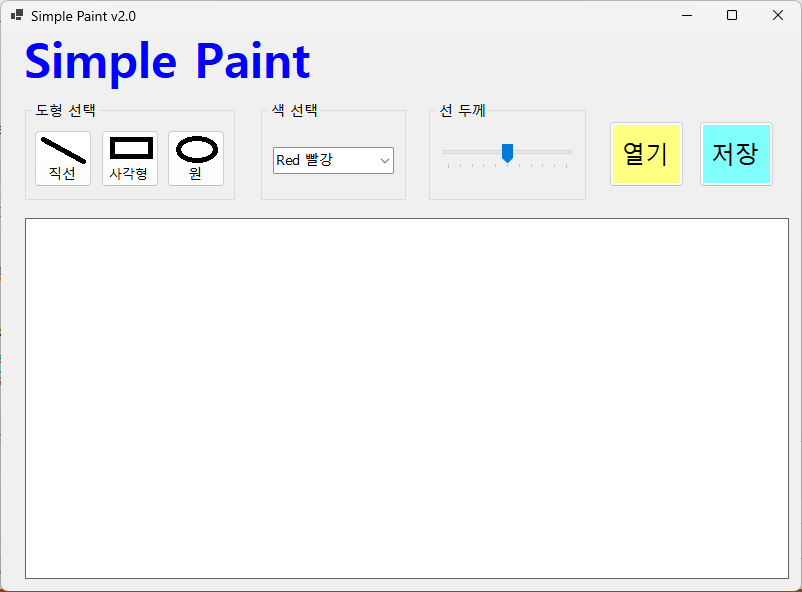
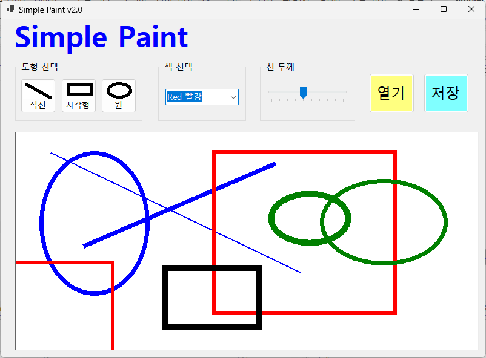

# (C# 코딩) 그림판
## 개요
- C# 프로그래밍 학습
- 1줄 소개: 직선, 사각형, 원을 그릴 수 있는 그림판 프로그램

- 사용한 플랫폼:
  - C#, .NET Windows Forms, Visual Studio, GitHub

- 사용한 컨트롤:
  - Label, ComboBox, TrackBar, Button, PictureBox

- 사용한 기술과 구현한 기능:
  - Visual Studio를 이용하여 UI 디자인
  - Bitmap과 Graphics 객체를 사용하여 도형 그리기
  - Paint 객체를 사용하여 색상과 선굵기를 적용하여 도형 그리기
  - TrackBar를 이용하여 선굵기 조절 기능 구현
  - ComboBox를 이용하여 색상 선택 기능 구현

## 실행 화면 (과제1)
- 코드의 실행 스크린샷과 구현 내용 설명

- 구현한 내용 (위 그림 참조)
  - UI 구성 : 도형선택, 색선택, 선굵기 조절, 그리기 영역
  - 도형 그리기 : 선택한 도형과 색상, 선굵기에 따라 그림판에 도형을 그리는 기능 구현
  - 도형선택 : Button을 직선, 사각형, 원 중에서 선택할 수 있도록 구현
  - 색선택 : ComboBox를 이용하여 색상을 선택할 수 있도록 구현
  - 선굵기 조절 : TrackBar를 이용하여 선의 굵기를 조절할 수 있도록 구현

## 실행 화면 (과제2)
- 코드의 실행 스크린샷과 구현 내용 설명

- 구현한 내용 (위 그림 참조)
  - 기능 구현 : 도형선택, 색선택, 선굵기조절, 그리기 기능 구현
  - 변수 초기화 : 도형, 색상, 선굵기 등의 변수 초기화
  - 이벤트 핸들러 : Button 클릭, ComboBox 선택 변경, TrackBar 값 변경 등의 이벤트 핸들러 구현
  - 도형 그리기 : 선택한 도형과 색상, 선굵기에 따라 그림판에 도형을 그리는 기능 구현
  - Paint 객체 사용 : 도형을 그릴 때 Paint 객체를 사용하여 색상과 선굵기를 적용하여 그리는 기능 구현
  - 점선으로 그리기 : 마우스를 드래그하여 도형을 그릴 때 점선으로 그리는 기능 구현
  - 미리보기 기능 : 드래그 중인 도형을 점선으로 미리 보여주는 기능 구현

## 실행 화면 (과제3)
- 코드의 실행 스크린샷과 구현 내용 설명

- 구현한 내용 (위 그림 참조)
  -  

## 실행 화면 (과제4)
- 코드의 실행 스크린샷과 구현 내용 설명

- 구현한 내용 (위 그림 참조)
  - 기능